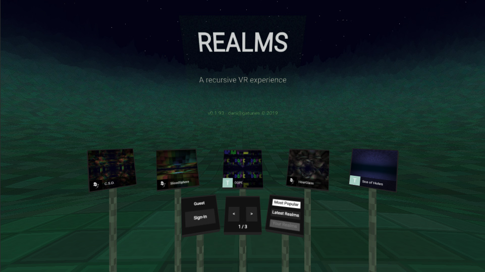

[RealmsVR](https://realmsvr.gatunes.com/)
[](https://travis-ci.org/danielesteban/RealmsVR)
===

[](https://realmsvr.gatunes.com/)

> A recursive VR experience

#### Live environment

 * [Client](https://realmsvr.gatunes.com/)
 * [API documentation](https://projects.gatunes.com/realmsvr/doc/) 

#### Dev dependencies

 * [MongoDB](https://www.mongodb.com/download-center/community) >= 4.0.6
 * [Node.js](https://nodejs.org/en/download/) >= 10.15.3 LTS
 * [Yarn](https://yarnpkg.com/en/docs/install) >= 1.15.2 Stable

#### Dev environment

```bash
git clone https://github.com/danielesteban/RealmsVR.git
cd RealmsVR
yarn install # (or run the "Install dependencies" task in vscode)
yarn start # (or press F5 in vscode)
```

You'll need to write your `GOOGLE_CLIENT_ID` and `GOOGLE_CLIENT_SECRET` into `api/.env` if you want to sign-in using the GoogleStrategy.
